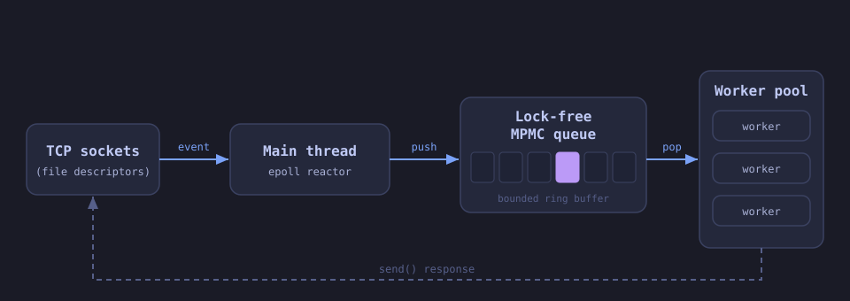

Hello! This is going to be my first post on my blog. I aim to occasionally blog
some of my projects, contributions, specifics of my setup... in order to
reflect on what I learned and hopefully keep a log I can go back to in the
future. This is also a way to keep my communication skills sharp by finally
writing something without AI assistance.

## The Project

This post is going to be about [my custom HTTP server
implementation](https://github.com/jesuscbm/posthaste). When I started this
project I was already familiar with the basics of Operating Systems (POSIX
threads, system calls, etc.), and I was already falling in love with Networking
as one of the most interesting parts of Computer Engineering in general. I
always liked fast code and getting to know internals, and I figured trying to
understand the logistics of one of the most used protocols in the world, and
trying to do it fast, could be great practice.

At the same time, I also wanted to learn modern C++ (move away from C +
classes). As this was a learning project, I avoided the use of AI (although I
did use it in a moment of weakness, I admit) or specific guides online, trying
to just learn about the basics and then implement my own server as I saw fit.
My main source of documentation was `man` and cppreference.

## The Interface

What I had in mind was a library that would make building your own custom HTTP
behavior a breeze. I imagined a user that just wants to build functions for
endpoints that get a `HttpRequest` and return a `HttpResponse`, and forget
about the rest. I had already decided I would use this library to implement a
PasteBin-like server (as it is useful and stylish to have your own for IRC
conversations), but the library itself is the focus, not what I built with it.

So now the interface for this library seems kind of clear. You create a server,
you assign endpoints (either specific or wildcard paths) to custom functions
and you run it. A specified signal (SIGINT or SIGTERM, for example) gracefully
shuts it down.

This is how the pastebin application uses the library:

```cpp
// src/main.cpp
HttpServer server(port, n_threads);

server.addEndpoint("/health", status);
server.addEndpoint("/", root_endpoint);
server.addEndpoint("/paste", handle_paste);
server.addEndpoint("/p/*", show_paste); // Wildcard support

server.serve(stop_signal);
```

There were a lot of challenges in this project. Some that I will not go into:

- Implementing a RAII TCP Server
- How excruciating and boring parsing logic can be, despite how fun state
  machines can appear.
- Support for partial reads.
- Plenty of debugging with GDB.
- Specific decisions regarding epoll (such as `EPOLLET`).
- Docker and deployment specifics.

## The epoll Architecture

So the main problem with a server like this, or better yet, the main problem
with networking, is that you have to do MANY tasks that are VERY concurrent
(say, attending many independent requests at the same time) that include a lot
of waiting. Usually the time it takes information to travel through the net is
orders of magnitude longer than the processing you have to do to it, so a naive
implementation will lead to CPU cycles lost waiting for information to arrive
instead of processing other requests.

To be more specific: Imagine we have one CPU thread, and we want to handle many
connections (thanks to UNIX philosophy, these connections are just file
descriptors for us, we can read from them when we receive information, and
write to them when we want to send information). Are we just going to be stuck
in a `while (!received)` loop until this connection sends us the request? Of
course not! What if while we are stuck on that loop another connection sends us
a request?

So what we want is the ability to wait on multiple connections at the same
time. Luckily, we have a way. Whenever we receive data through these TCP
connections, the kernel is going to have to move that data to the file
associated with that connection anyway, so there is a system call to tell the
kernel "while you are on it, wake me up when this connection gets data". This
system call is `epoll` (or `select`, the older, slightly less cool
alternative).

So using this system call, we decided this architecture:

- Only the main thread waits on `epoll` for any updates.
- The main thread will constantly accept new connections, and add them to our
  `epoll` "waiting list".
- When the main thread sees activity on an established connection, it will send
  this connection to another thread to be handled.
- Many threads are just waiting on the `LockFreeQueue` for connections to be
  pushed.



The key detail is `EPOLLONESHOT`: after a worker handles a connection, the
socket is removed from epoll until the worker explicitly re-arms it, so two
threads never parse the same fd at the same time:

```cpp
// src/http/httpserver.cpp
// On a new connection
struct epoll_event new_ev;
new_ev.events = EPOLLIN | EPOLLET | EPOLLONESHOT;
new_ev.data.fd = new_fd;
epoll_ctl(epoll_fd, EPOLL_CTL_ADD, new_fd, &new_ev);

// After handling, re-arm so epoll wakes us on the next packet
struct epoll_event ev;
ev.events = EPOLLIN | EPOLLET | EPOLLONESHOT;
ev.data.fd = fd;
epoll_ctl(epoll_fd, EPOLL_CTL_MOD, fd, &ev);
```

As we have only one thread waiting on `epoll`, this is called a **Reactor
Pattern**. Another option would be having all threads wait on `epoll`
simultaneously, treating them as interchangeable workers rather than having a
dedicated dispatcher thread.

The coolest part? I didn't realize at the moment, but now I realize what I
implemented is a specific case of async programming. When I later learned about
async in Python and in more modern C++, the internals were already there.

## The Lock-Free Queue

Now let's focus on another specific of the project: the `LockFreeQueue`. The
idea is easy: an interface for threads to push and pop connections to handle.
The only difference with a normal queue is the need for a blocking pop
operation, so that threads can passively wait for new content.

Originally this was a simple wrapper around `std::queue`, safeguarded by a
mutex to prevent race conditions. However, I revisited it later in order to get
something faster and more interesting.

The world of lock-free data structures is interesting and bigger than I
imagined, but for this project I mostly followed the [Ode to a Vyukov
Queue](https://int08h.com/post/ode-to-a-vyukov-queue/) post. It does a much
better job explaining the algorithm than I would, so I will just describe the
shape of the thing and how it fits the project.

The queue is a bounded MPMC (multi-producer, multi-consumer) ring buffer. Each
cell stores an item plus a sequence number. Two counters, `top` and `bottom`,
act as tickets: `top` is for consumers, `bottom` for producers. The sequence
number in each cell tells which side owns the cell at any moment. Because the
buffer size is a power of two, indexing is just `counter & mask` instead of the
naive `counter % size`. To avoid false sharing, `top` and `bottom` live on
their own cache lines:

```cpp
// src/http/lockfreequeue.hpp
struct Cell {
    T item;
    std::atomic_uint32_t sequence;
};

std::array<Cell, Size> buffer;
alignas(64) std::atomic_uint32_t top;
alignas(64) std::atomic_uint32_t bottom;
```

To implement the blocking pop operation, I used a condition variable. The
interesting tension is that a truly lock-free queue cannot block, so the
"blocking pop" is a hybrid: the queue body is lock-free, but the sleep/wake
mechanism uses a mutex and a condition variable. The workers loop on
`wait_pop()`, executing tasks or exiting when shutdown sets the stop flag.

```cpp
// src/http/threadpool.cpp
threads.emplace_back([this] {
    for (;;) {
        std::optional<std::function<void()>> task;
        task = queue.wait_pop();
        if (task)
            (*task)();
        else
            break; // End the thread
    }
});
```

The reactor thread pushes connection tasks with `tp.addTask(...)`, and a worker
picks them up from the queue. It is not a perfect implementation by any means, but it is a fun excuse to learn about memory ordering and atomics.

## A Debugging Journey: Nginx Hang

When I put the project online at `paste.jesusblazquez.eu`, I ran it behind
Nginx as a reverse proxy. Things seemed to work locally, but through Nginx the
`POST /paste` form submission would hang for seconds or time out.

The issue was response framing. My `HttpResponse` only emits a `Content-Length`
header when a body has been set:

```cpp
// src/http/httpresponse.cpp
void HttpResponse::setBody(std::string body) {
    this->body = std::move(body);
    headers["Content-Length"] = std::to_string(this->body.size());
}

std::string HttpResponse::serialize() const {
    std::string ss;
    ss.append(getStatusText(this->code)).append("\r\n");
    for (const auto &p : this->headers)
        ss.append(p.first).append(": ").append(p.second).append("\r\n");
    ss.append("\r\n").append(this->body);
    return ss;
}
```

And `serialize()` just writes the status line, the headers, and the body. The
server never sends a `Connection: close` header and never implements chunked
encoding, so every response must be self-delimiting through `Content-Length`.

For `POST /paste`, the curl branch returned a plain-text URL, so `setBody` was
called and `Content-Length` was present. The browser branch, however, returned
a 303 redirect with only a `Location` header and forgot to set a body. No body,
no `Content-Length`, no `Connection: close`. Nginx therefore had no way to know
where the response ended, and would wait for more bytes until the proxy read
timeout hit.

The fix was one line:

```cpp
// src/endpoints.cpp
response.setStatusCode(303);
response.addHeader("Location", url);
response.setBody("");   // <-- this
```

Calling `setBody("")` forced `Content-Length: 0`, which gave Nginx a clean
end-of-message. This is a good reminder that protocols only work when everyone
follows them: HTTP/1.1 requires every response to be self-delimiting, and local
curl tests can hide framing bugs that only a reverse proxy will exercise.

## Performance

I run `wrk -t4 -c100 -d10s` against a local instance, client and server sharing
the machine: an Intel Core i5-10210U (4 cores, 8 threads).

| Endpoint | Requests/sec | Transfer/sec | Avg latency | Total requests |
| --- | --- | --- | --- | --- |
| `GET /health` | 123,027 | 10.1 MB/s | 743 µs | 1,232,578 |
| `GET /` (`index.html`) | 47,805 | 219.3 MB/s | 1.91 ms | 479,202 |

`/health` is the reactor and parser at their cheapest. `/` serves a file from
the page cache, so 219 MB/s is mostly memory bandwidth.

## Next Steps

So, how good is this implementation? Pretty bad. I like the easy, fine-grained
control the library gives. However, the implementation doesn't even cover
everything HTTP/1.0 has to offer. 

It doesn't crash or slow down under load (see [Performance](#performance)), but
it is still not fast. Still, the main problem with my server is the
system-call overhead. Further reading into modern HTTP implementations showed
me that the syscall-per-event model of `epoll` has a real cost, and newer
designs try to avoid it. This approach needs many system calls when processing:
For waiting, we use `epoll_wait`, when we get the descriptor for the pending
connection, then we `recv` the information and parse it. Finally, we `send` it
back. System calls are notoriously expensive as they require a context switch,
and this is just to move information from kernelspace to userspace
(that is what recv and send are actually doing). Why bother?

The modern solution is `io_uring`, which allows us to batch our submissions. It
is out of the scope of this blog and project, but in short it just means having
shared queues with the kernel: 
- The Submission Queue (SQ): In which you put I/O requests. For example: "I
  want to read from X into buffer B, I want to send what's in buffer A to Y"
- The Completion Queue (CQ): In which the kernel tells you "X says B's content
  to you, you successfully sent A's contents to Y".

In these two examples, A and B are located in buffers in your application
memory space, so transmitting this data from kernelspace to userspace requires
no system call. With this, it is easy to see how one can turn 5 I/O requests
into what is essentially pushing the 5 requests to the SQ and one system call
to notify the kernel of the new submissions.

## Vulnerabilities

From time to time I come back to this project and try to make it a little bit
better. For example, during my internship at INSAIT, when I was learning about
fuzzers, I tried to run it through a fuzzer. I found two vulnerabilities (no
spoilers, but critical DoS ones); but then I thought: Why bother? These are
great in case I ever do a follow-up workshop on Denial of Service, or fuzzing
or something. Having an actual target can be entertaining for students doing
this for the first time. As the deployment is safe, I would not get mad if
someone were to crash my [server](https://paste.jesusblazquez.eu), as long as
it is a good learning experience.

